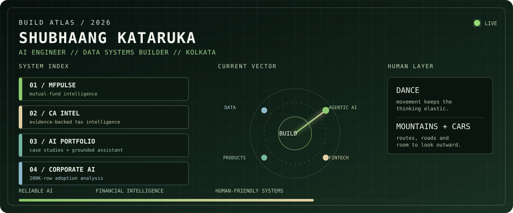
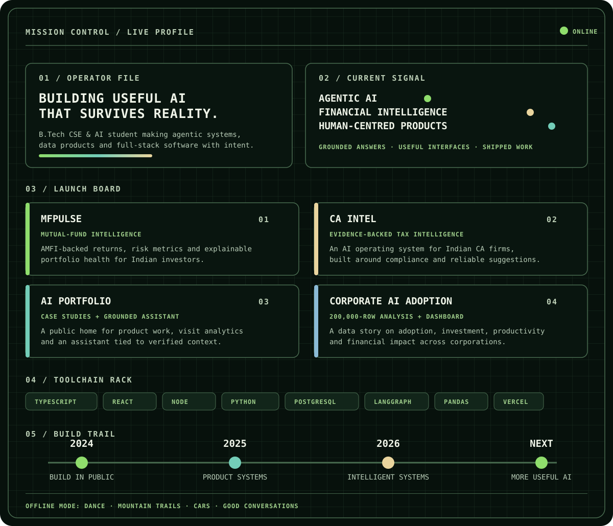

<code>SHIP USEFUL SYSTEMS · KEEP THE HUMAN IN THE LOOP · LEAVE LOCALHOST</code>

<code>OPEN A BUILD</code>

[MFPulse ↗](https://mf-pulse.vercel.app) &nbsp;·&nbsp; [CA Intel ↗](https://ca-intel.vercel.app) &nbsp;·&nbsp; [AI Portfolio ↗](https://www.shubhaangkataruka.in) &nbsp;·&nbsp; [Corporate AI Adoption ↗](https://github.com/S-h-u-b-h-1/Corporate-AI-Adoption)

<code>BADGE CABINET / EARNED IN PUBLIC</code>

<code>CONTRIBUTION CURRENT / FOLLOW THE TRAIL</code>

<picture>
  <source media="(prefers-color-scheme: dark)" srcset="https://raw.githubusercontent.com/S-h-u-b-h-1/S-h-u-b-h-1/output/github-contribution-grid-snake-dark.svg">
  <source media="(prefers-color-scheme: light)" srcset="https://raw.githubusercontent.com/S-h-u-b-h-1/S-h-u-b-h-1/output/github-contribution-grid-snake.svg">
  
</picture>

[LinkedIn ↗](https://www.linkedin.com/in/shubhaang-kataruka/) &nbsp;·&nbsp; [Portfolio ↗](https://www.shubhaangkataruka.in) &nbsp;·&nbsp; [LeetCode ↗](https://leetcode.com/u/Shubh_2201/) &nbsp;·&nbsp; [Holopin ↗](https://www.holopin.io/@shubhaang)

<code>BUILD WELL. STAY CURIOUS. KEEP MOVING.</code>

