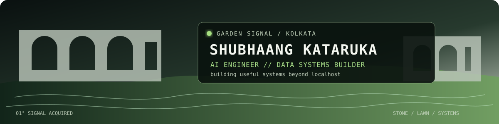

<div align="center">



<sub><code>AI ENGINEERING · DATA SYSTEMS · FINTECH INTELLIGENCE · FULL-STACK PRODUCTS</code></sub>

</div>

<table>
<tr>
<td width="62%" valign="top">

## Signal / 01

I’m **Shubhaang Kataruka**, a B.Tech CSE & AI student building agentic AI, data systems and product-grade software. I like systems with evidence, interfaces with intent, and ideas that survive outside a demo.

**Now transmitting:** reliable AI products, financial intelligence, and human-friendly technical work.

</td>
<td width="38%" valign="top">

```text
ROLE     AI Engineer
BASE     Kolkata, India
MODE     building in public
OFFLINE  dance / mountains / cars
STATUS   signal is strong
```

</td>
</tr>
</table>

<details>
<summary><b>Open field notes</b></summary>

<br>

```text
> I don't collect frameworks. I make them do useful things.
> Current direction: AI × finance × public-interest technology.
> Outside runtime: dance, mountain trails, cars and good conversations.
```

</details>

## Systems on the radar

| Signal | What it does | Launch |
|---|---|---|
| **01 / MFPulse** | Indian mutual-fund intelligence with AMFI-backed returns, rolling performance, risk metrics and explainable portfolio health. | [Open MFPulse](https://mf-pulse.vercel.app) |
| **02 / CA Intel** | An AI operating system for Indian CA firms: compliance, tax intelligence and evidence-backed suggestions. | [Open CA Intel](https://ca-intel.vercel.app) |
| **03 / AI Portfolio** | Animated case studies, visit analytics and an AI assistant grounded in verified portfolio context. | [Enter portfolio](https://www.shubhaangkataruka.in) |
| **04 / Corporate AI Adoption** | A 200,000-row analysis of AI adoption, investment, productivity and financial impact—with an interactive dashboard. | [Explore the data](https://github.com/S-h-u-b-h-1/Corporate-AI-Adoption) |

## Build log

```text
2024  / learned by building in public — first web projects and open-source contributions
2025  / moved from pages to products — full-stack apps, authentication, databases and fintech tooling
2026  / went deep on intelligent systems — agentic AI, RAG, forecasting, analytics and deployments
NEXT  / make AI more useful, reliable and human
```

## Workbench

<div align="center">

`TypeScript` · `JavaScript` · `Python` · `React` · `Node.js` · `Express` · `PostgreSQL` · `Prisma` · `Tailwind`

`LangGraph` · `LangChain` · `scikit-learn` · `Pandas` · `Streamlit` · `Vercel`

</div>

## Badge cabinet

<div align="center">

[](https://www.holopin.io/@shubhaang)

<sub>Badges earned along the way — tap to visit my Holopin profile.</sub>

</div>

## Contribution current

<div align="center">

<picture>
  <source media="(prefers-color-scheme: dark)" srcset="https://raw.githubusercontent.com/S-h-u-b-h-1/S-h-u-b-h-1/output/github-contribution-grid-snake-dark.svg">
  <source media="(prefers-color-scheme: light)" srcset="https://raw.githubusercontent.com/S-h-u-b-h-1/S-h-u-b-h-1/output/github-contribution-grid-snake.svg">
  
</picture>

</div>

## Reach the signal

<div align="center">

[LinkedIn](https://www.linkedin.com/in/shubhaang-kataruka/) · [Portfolio](https://www.shubhaangkataruka.in) · [LeetCode](https://leetcode.com/u/Shubh_2201/) · [Holopin](https://www.holopin.io/@shubhaang)

<sub><code>STONE / LAWN / SYSTEMS</code></sub>

</div>
